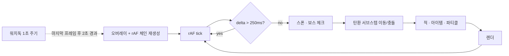

# CYBER ROBOT: ARENA

브라우저에서 도는 탑다운 로그라이트 슈터.
의존성 없는 **단일 HTML 파일 1,480줄** — 프레임워크·번들러·에셋이 없다.

**▶︎ https://molang808.github.io/cyber-robot-arena/**

그런데 이 저장소의 3분의 1은 게임이 아니라 **게임을 재는 도구**다.
"이 게임은 몇 점에서 무너지는가"를 손으로 몇 판 해보는 것으로는 알 수 없어서
밸런스 시뮬레이터를 만들었고, **그 도구가 네 번 판단을 뒤집었다.**

| 측정한 것 | 결과 |
|---|---|
| "플레이어가 무한히 강해져 무적이 된다"는 가설 | **반증됐다** — 실제 붕괴는 반대 방향이었다 |
| 난이도가 점수에 종속돼 있던 구조 | 콤보가 점수를 **6.6배** 부풀려 잘할수록 빨리 처벌받고 있었다 |
| 최적 선택 플레이어와 무작위 선택의 DPS 격차 | **81배 → 2.1배** |
| 무제한 성장을 막는 상한 정책 4종 | **전부 실패** — 원인은 스탯이 아니라 무기 밸런스였다 |
| 진화 조합을 실제로 볼 수 있는가 | 목격률 **35% → 91%** |
| "픽이 카탈로그보다 많아 다 먹는다"는 판단 | **틀린 계산이었다** — 실제 커버리지 67% |

전부 [밸런스 — 측정하고 고친 것](#밸런스--측정하고-고친-것)에 근거와 함께 적었고,
데이터셋은 [`docs/`](docs/)에 있어 재현할 수 있다.

### 이 문서를 읽는 법

| 관심사 | 볼 곳 |
|---|---|
| 어떻게 만들었나 | [시스템 설계](#시스템-설계) — 게임 루프·충돌·성능 예산 |
| **무엇을 재고 무엇을 바꿨나** | [밸런스](#밸런스--측정하고-고친-것) — 이 프로젝트의 핵심 |
| 무엇을 알고 남겨뒀나 | [알려진 한계와 다음 단계](#알려진-한계와-다음-단계) |

| | |
|---|---|
| 플랫폼 | 웹 (Canvas 2D), 데스크톱·모바일 터치 지원 |
| 언어 | JavaScript (ES2020), 외부 라이브러리 0개 |
| 규모 | 게임 1,480줄 · 도구 888줄 |
| 콘텐츠 | 업그레이드 46종(진화 4 포함) · 무기 17종 · 적 4종 + 보스 3종 · 영구 강화 10종 · 해금 5종 · 효과음 11종 |
| 검증 | 밸런스 시뮬레이터 + 테스트 20개 (CI 통과해야 배포) |

## 플레이

**▶︎ https://molang808.github.io/cyber-robot-arena/**

로컬에서 돌리려면:

```bash
python3 -m http.server 5173
```

브라우저에서 `http://localhost:5173`.

**조작** — `WASD` / 방향키 이동, 사격은 자동.
`Space` 대시 — 이동 중에만 발동, 순간 속도 ×6에 **20프레임 무적**, 쿨다운 90프레임.

## 스크린샷

<!-- docs/play.gif · docs/upgrade.png 을 넣고 아래 주석을 풀 것


-->

---

# 시스템 설계

## 1. 게임 루프와 프레임 안정성

`requestAnimationFrame` 기반 단일 루프. 실제로 시간을 많이 쓴 곳은 로직이 아니라
**"루프가 죽지 않게 만드는 일"** 이었다. 세 겹의 방어가 들어가 있다.



**① 랙 프레임 폐기** — `delta > 250ms`인 프레임은 시뮬레이션 없이 건너뛴다.
탭을 오래 비활성화했다 돌아왔을 때 밀린 시간만큼 한 번에 계산하면서 적이 순간이동하거나
플레이어가 즉사하는 문제를 막는다. `visibilitychange`에서도 `lastTime`을 리셋한다.

**② 프리즈 워치독** — 1초마다 마지막 프레임 시각을 확인해서 2초 이상 갱신이 없으면
rAF 체인이 끊어진 것으로 보고 오버레이를 띄운 뒤 **새 체인을 건다**. 루프를 정지시키지 않고
복구만 시도하는 것이 핵심이다. 게임 상태는 그대로 두므로 플레이어는 멈췄다 이어서 진행한다.

**③ 비상 탈출** — 판 시작 3초 뒤 "업그레이드 유지 재시작" 버튼이 나타난다. 복구가 실패해도
쌓아둔 빌드와 크레딧을 잃지 않고 다시 시작할 수 있다. `restartKeepUpgrades()`가
획득한 업그레이드의 효과 함수를 새 플레이어 인스턴스에 다시 적용한다.

> 워치독은 원인을 고치는 코드가 아니라 증상을 덮는 코드다. 근본 원인(특정 무기 조합에서의
> 프레임 급락)을 프로파일링으로 찾는 대신 안전망을 먼저 깐 것은 명백한 트레이드오프였다.
> → [알려진 한계](#알려진-한계와-다음-단계)

## 2. 업그레이드 드래프트 — 데이터 주도 설계

42종의 업그레이드는 전부 `UPGRADES` 배열 하나에 **데이터로** 정의돼 있다.
분기문이 아니라 테이블이다.

```js
{id:'sniper', name:'저격 소총', icon:'🎯', desc:'초고속 관통 4배 데미지',
 r:'epic', once:true, ef:p=>{p.wt='sniper'; p.gc=55;}}

{id:'blade2', name:'공전 검 강화', icon:'🗡️', desc:'공전 검 추가 +1',
 r:'rare', once:false, req:'blade', ef:p=>{p.orbBlades=(p.orbBlades||1)+1;}}
```

- `ef` — 플레이어 인스턴스를 받아 **직접 변형하는 함수**. 업그레이드 로직 전체가 이 한 줄에 있다.
  새 업그레이드를 추가할 때 게임 루프나 렌더 코드는 건드리지 않는다.
- `once` — 1회성(무기 교체, 관통 등)인지 중첩 가능(스탯 증가)인지
- `req` — 선행 조건. `blade`를 먼저 뽑아야 `blade2`가 풀에 등장한다
- `r` — 레어도. 뽑기 가중치를 결정한다

**추첨 절차**

1. `once`로 이미 획득한 것, `req` 미충족인 것을 풀에서 제외
2. 남은 항목을 레어도 가중치만큼 복제해 배열을 만든다 (`common:10, rare:4, epic:2, legendary:1`)
3. 중복 없이 3장이 찰 때까지 뽑는다 (최대 400회 시도 후 포기)

가중치와 카탈로그 구성이 만드는 **실제 등장 확률**은 이렇다.

| 등급 | 카탈로그 | 가중치 | 풀 지분 | 초기 등장률 |
|---|---:|---:|---:|---:|
| common | 7종 | ×10 | 70 | 44.6% |
| rare | 12종 | ×4 | 48 | 30.6% |
| epic | 16종 | ×2 | 32 | 20.4% |
| legendary | 7종 | ×1 | 7 | **4.5%** |
| | 42종 | | 157 | 100% |

가중치만 보면 legendary가 common의 1/10이지만, epic 항목이 16종으로 가장 많아서
**풀 지분에서는 epic이 legendary의 4.6배**가 된다. 등급 가중치와 콘텐츠 수량이
곱해져야 최종 확률이 나온다는 점이 이 테이블의 요지다.

또 하나 — `once` 업그레이드는 획득하면 풀에서 영구히 빠지므로 **판이 진행될수록 분포가 이동한다.**
후반에는 중첩 가능한 스탯 업그레이드 비중이 자연스럽게 올라가면서 선택지가 무난해진다.

## 3. 무기 12종

무기는 별도 클래스가 아니라 플레이어의 `wt`(weapon type) 문자열 + 발사 쿨다운 `gc` 조합이다.
발사 시점에 `wt`로 분기해 탄환의 초기 상태를 다르게 만든다.

| 무기 | 등급 | 쿨다운 | 특징 |
|---|---|---:|---|
| 개틀링 건 | epic | 5f | 초고속 다연발 |
| 화염방사기 | epic | 4f | 광범위 화염 |
| 듀얼 건 | common | 20f | 쌍발 |
| 플라즈마 캐논 | legendary | 20f | 범위 폭발 |
| 체인 라이트닝 | legendary | 22f | 적 사이 연쇄 |
| 도탄 총기 | epic | 22f | 벽 반사 (`bc` 반사 횟수) |
| 유도 미사일 | epic | 26f | 추적 + 폭발 |
| 산탄총 | rare | 32f | 7방향 |
| 레이저 빔 | epic | 44f | 직선 관통 |
| 중력 캐논 | legendary | 45f | 탄환 주변 적을 흡입 |
| 레일건 | epic | 50f | 극초고속 관통 |
| 저격 소총 | epic | 55f | 4배 데미지 관통 |

쿨다운과 위력이 반비례하도록 배치했고, 여기에 `fire_rate`(−20%)·`overcharge`(−40%)
같은 스탯 업그레이드가 곱해지면서 **빌드에 따라 같은 무기가 전혀 다르게 굴러간다.**
쿨다운 하한은 4프레임으로 고정해 초당 발사 수가 발산하지 않게 막았다.

탄환 속성(`pr` 관통 / `hm` 추적 / `ae` 폭발 / `bc` 반사)은 무기와 독립된 플래그라
**무기 × 속성 조합**이 그대로 곱연산으로 늘어난다. 산탄총 + 관통 + 폭발 같은 조합이 성립한다.

## 4. 적과 난이도 곡선

적은 매 프레임이 아니라 **35프레임마다 한 번** 플레이어 방향으로 속도를 갱신한다.
매 프레임 추적하면 완벽하게 따라붙어 회피가 불가능해지고, 갱신 주기를 두면
적이 관성으로 흘러가면서 플레이어가 비집고 나갈 틈이 생긴다. 성능과 게임성을 동시에 얻은 지점이다.

| 종류 | 출현 | HP | 속도 | 점수 | 비고 |
|---|---:|---|---:|---:|---|
| normal | 73% | `1+⌊diff×0.6⌋` | ×1.0 | 20 | |
| fast | 12% | 1 | ×2.1 | 35 | 크기 ×0.65 |
| tank | 8% | `6+⌊diff×1.1⌋` | ×0.45 | 60 | 크기 ×1.6 |
| bomber | 7% | 2 | ×1.0 | 40 | 사망 시 반경 80 내 적에게 3 데미지 — **연쇄 폭발** |
| BOSS | 1,000점마다 | `30+score×0.028` | | 200 | 60프레임마다 3발 확산 사격 |
| MEGA | 5,000점마다 | `80+score×0.07` | | 500 | 5발 확산 |

bomber의 연쇄 폭발은 `dOb()`가 자기 자신을 재귀 호출하는 구조라, 뭉쳐 있는 적 무리를
하나 터뜨려 도미노로 지우는 순간이 만들어진다.

**난이도는 점수가 아니라 경과 시간의 함수다.**

```
gameT    = fC / 60                      // 경과 초. 업그레이드 화면에서는 멈춘다
wave     = 1 + ⌊gameT / 15⌋
diff     = 1 + gameT × 0.012            // 적 HP·속도 스케일
스폰 간격 = max(16, 75 − wave×4) 프레임
동시 최대 = min(25 + wave×3, 80) 마리
보스      = 60초마다 / 메가 보스 = 180초마다
```

처음에는 난이도가 **점수**에 종속돼 있었다. 그 설계가 왜 무너지는지는
[밸런스 — 측정하고 고친 것](#밸런스--측정하고-고친-것)에 적었다.

웨이브 3부터 두 번째 스폰 라인(`iv×2+3`), 웨이브 6부터 세 번째(`iv×3+7`)가 추가된다.
주기를 `×2`, `×3`이 아니라 `+3`, `+7`로 어긋나게 둔 이유는 **세 라인이 같은 프레임에 겹쳐
한꺼번에 쏟아지는 것을 피하기 위해서**다. 서로소에 가까운 주기라 스폰이 고르게 흩어진다.

성장은 점수가 아니라 **xp**를 쓴다. 점수에는 콤보 배수가 곱해지지만 xp에는 붙지 않는다.
업그레이드는 xp 2,000까지 200마다, 이후 `200 + ⌊(xp−2000)/500⌋ × 50`마다 —
초반엔 빠르게 빌드를 세우고 후반엔 완만해지도록 의도했다.

정리하면 **세 축이 서로 독립이다.**

| 축 | 기준 | 콤보 영향 |
|---|---|---|
| 난이도 | 경과 시간 `gameT` | 없음 |
| 성장 | 처치 누적 `xp` | 없음 |
| 점수 | `basePts × 콤보배수` | 있음 (표시 전용) |

## 5. 충돌 처리 — 서브스텝으로 터널링 막기

이 프로젝트에서 가장 오래 붙잡은 문제. 레일건·저격 소총처럼 빠른 탄환이
**프레임 사이에 적을 뛰어넘어** 명중 판정이 나지 않았다.

원인은 단순하다. 탄환이 프레임당 26px 이동하는데 적의 반지름이 10px이면,
이동 전과 이동 후 위치에서만 거리를 재는 방식으로는 사이에 있던 적을 놓친다.

해결은 **이동을 잘게 쪼개는 것**이다.

```js
const bSpd = Math.hypot(b.vx, b.vy);
if (bSpd > 26) { const r = 26/bSpd; b.vx *= r; b.vy *= r; }   // 속도 상한
const steps = Math.max(1, Math.ceil(bSpd / 10));              // 10px당 1스텝
const sx = b.vx/steps, sy = b.vy/steps;

for (let st = 0; st < steps && !hit; st++) {
  b.x += sx; b.y += sy;
  // 벽 반사(도탄)도 스텝 안에서 처리 — 반사 직후 충돌까지 같은 프레임에 잡힌다
  // 이 위치에서 적 충돌 검사
}
```

- **속도 상한 26px/frame** — 스텝 수가 무한정 늘어나지 않게 하는 안전장치
- **10px당 1스텝** — 가장 작은 적의 크기보다 촘촘하게. 최대 3스텝
- `hit` 플래그로 명중 즉시 남은 스텝을 중단해 한 탄환이 여러 번 판정되지 않게 했다

적 탄환은 이 경로를 타지 않는다. 플레이어 하나와만 충돌하면 되므로 적 목록을 순회할 필요가 없고,
서브스텝 없이 단순 이동 + 단일 거리 검사로 분리했다. **필요한 곳에만 정밀도를 쓴다.**

## 6. 성능 예산

브라우저에서 수백 개의 오브젝트가 동시에 도는 만큼, 상한선을 코드에 박아두었다.

| 대상 | 상한 | 초과 시 |
|---|---:|---|
| 파티클 | 400 | 생성 함수가 즉시 반환 (`spP`/`spB`) |
| 탄환 | 280 | 가장 오래된 것부터 잘라냄 |
| 일반 적 | `min(25+wave×3, 80)` | 스폰 중단 |
| 아이템 | 30 | 드랍 생략 |

파티클은 **생성 시점에 막는다.** 이미 400개가 있으면 폭발 이펙트를 아예 만들지 않고,
여유가 있으면 `Math.min(n, 400-parts.length)`개만 만든다. 매 프레임 배열을 순회하며
지우는 것보다 만들지 않는 쪽이 싸다.

탄환은 반대로 **오래된 것부터 버린다.** 화면 밖으로 나간 탄환은 어차피 다음 프레임에
정리되므로, 상한을 넘겼을 때 앞쪽(=오래된)부터 잘라내면 방금 쏜 탄환은 살아남는다.

## 7. 메타 진행 — 판을 넘어 남는 성장

한 판에서 모은 크레딧은 `localStorage`(키 `ca4`)에 누적되고, 타이틀 화면의 **영구 상점**에서
10개 라인에 투자한다. 비용은 `(현재 레벨 + 1) × 기준가`로 선형 증가한다.

| 라인 | 효과 | 기준가 |
|---|---|---:|
| 자석 모듈 | 흡수 범위 +30 | 100 |
| 이동 부스터 | 이동 속도 +0.3 | 120 |
| 데이터 마이닝 | 크레딧 획득 +20% | 130 |
| 장갑 업그레이드 | 최대 체력 +1 | 150 |
| 검 궤도 확대 | 공전 검 반경 +15 | 160 |
| 경험치 증폭 | 업그레이드 간격 −10점 | 170 |
| 화력 강화 칩 | 탄환 데미지 +1 | 180 |
| 장전 보조 | 발사 쿨다운 −5% | 200 |
| 전기장 모듈 | 전기 오라 +1 | 220 |
| 초기 장갑 | 시작 반경 +1 | 250 |

영구 강화 수치는 `Player` 생성자에서 초기값에 더해진다 — 판 중 업그레이드와 같은 필드를
건드리므로 별도 처리 경로가 없다.

```js
this.spd = 2.8 + pd.spL * 0.3;      // 영구 강화
this.mhp = 5   + pd.hpL;
this.bd  = 1   + pd.dmL;
// 판 중 업그레이드는 같은 필드를 다시 곱하거나 더한다: p.spd *= 1.25
```

**크레딧은 사망 시점이 아니라 판을 떠나는 모든 경로에서 저장한다.** 게임 오버, 홈으로 나가기,
비상 재시작 — 세 곳 모두에서 `pd.credits += cE; sP();`를 호출한다. 초기 버전에서
비상 재시작으로 나가면 그 판의 크레딧이 통째로 사라지던 버그가 있었다.

**저장소가 막혀도 게임은 돌아간다.** 초기 버전은 `localStorage.getItem()`을 무방비로 호출했다.
샌드박스 iframe·`data:` URL·쿠키 차단 환경에서는 이 호출이 `SecurityError`를 던지고
**스크립트 전체가 그 줄에서 멈춘다.** 타이틀 화면은 정적 HTML이라 멀쩡히 보이는데
시작 버튼만 먹지 않는, 원인을 찾기 어려운 형태로 나타난다. itch.io처럼 게임을
샌드박스 iframe에 넣어 서비스하는 플랫폼에서 그대로 재현되는 문제였다.

```js
const PD0={credits:0,hpL:0,/* ... */};
let stOK=true;
let pd=(()=>{try{const r=localStorage.getItem('ca4');return r?{...PD0,...JSON.parse(r)}:{...PD0};}
  catch(e){stOK=false;return {...PD0};}})();
const sP=()=>{if(!stOK)return;try{localStorage.setItem('ca4',JSON.stringify(pd));}catch(e){stOK=false;}};
```

읽기·쓰기를 모두 감싸고 실패하면 메모리 진행도로 후퇴한다. **판은 정상 진행되고 영구 강화만
저장되지 않는다** — 저장 실패가 플레이 자체를 막지 않는 것이 요점이다.
기본값을 스프레드로 병합하는 것도 의도적이다. 예전 세이브에 새 강화 라인 키가 없어도
`undefined`가 수식에 섞여 `NaN`이 되지 않는다.

## 8. 아이템 드랍

적 처치 시 30% 확률로 아이템이 떨어진다(보스는 70% 확률로 3개). 종류는 가중 추첨이다.

| 아이템 | 가중치 | 확률 | 효과 |
|---|---:|---:|---|
| 코인 | 14 | 58.3% | 크레딧 `random(10~65) × 획득배수 × 콤보배수` |
| 탄약 | 3 | 12.5% | 발사 쿨다운 즉시 충전 — 다음 한 발을 바로 쏜다 |
| 회복 | 2 | 8.3% | 체력 +1 |
| 보호막 | 2 | 8.3% | 200프레임(약 3.3초) 무적, `shield_gen`으로 연장 |
| 슬로우 | 2 | 8.3% | 200프레임간 적 속도 −72%, `time_warp`로 ×3 |
| 폭탄 | 1 | 4.2% | 화면 중앙 반경 200에 `데미지×3` 광역 피해 |

코인이 절반을 넘는 이유는 **드랍이 곧 메타 진행의 통화**이기 때문이다. 한 판이 실패로 끝나도
다음 판이 조금 강해진다는 감각이 유지돼야 반복 플레이가 성립한다.

아이템은 플레이어의 자석 범위(`mgR`, 기본 80) 안에 들어오면 끌려온다.
`supermagnet` 업그레이드를 얻으면 범위가 맵 전체로 확장되고 흡입 속도도 거리에 비례해 빨라진다.

---

# 밸런스 — 측정하고 고친 것

어릴 때 하던 탑다운 슈터에서 **어느 지점을 넘으면 죽는 게 오히려 어려워지는** 경험이 있었다.
이 게임에도 같은 일이 일어나는지 확인하고 싶었는데, 손으로 몇 판 해보는 것으로는 알 수 없었다.
그래서 도구를 먼저 만들었다.

## 도구 — `tools/balance-sim.mjs`

```bash
node tools/balance-sim.mjs --runs 300 --seconds 600   # 300판을 10분씩 시뮬레이션
node tools/balance-sim.mjs --sweep                    # 명중률 민감도 스윕
node tools/balance-sim.mjs --strategy greedy          # DPS 최대화 플레이어
node tools/balance-sim.mjs --csv > out.csv
```

`index.html`에서 `UPGRADES` 배열을 **그대로 파싱해 실제 `ef` 함수를 재사용한다.**
업그레이드 테이블을 고치면 시뮬레이터 결과도 함께 바뀌므로 둘이 갈라지지 않는다.

측정하는 것은 **처리량 여유**다 — 초당 처치 가능 수를 초당 스폰 수로 나눈 값.
1보다 크면 밀려드는 적을 감당하고도 남고, 1보다 작으면 화면에 적이 쌓인다.

> **이 모델의 가장 큰 가정은 명중률이다.** 이론 DPS 전부가 적에게 꽂히지는 않는다.
> 실측 없이는 알 수 없어 파라미터로 두고 15%~100% 전 구간을 함께 본다.
> 아래 결론은 전 구간에서 방향이 같았던 것만 적었다.

## 발견 1 — 콤보가 난이도 시계를 부풀리고 있었다

원래 난이도는 **점수**에 종속돼 있었다 (`wave = 1 + ⌊score/300⌋`).
그런데 점수에는 콤보 배수가 곱해진다 (`pts = basePts × comboMultiplier`).
콤보 배수에는 상한이 없어서, 연속 처치가 길어질수록 점수가 실제 처치량보다 빠르게 부푼다.

같은 실력·같은 명중률로 콤보만 켜고 끈 대조 실험 (200판 중앙값, 명중률 35%):

| 경과 | 콤보 켬 | 콤보 끔 | 배율 |
|---|---:|---:|---:|
| 120초 | 9,508점 | 2,601점 | 3.7배 |
| 180초 | 40,541점 | 6,642점 | 6.1배 |
| 300초 | 107,410점 | 16,280점 | **6.6배** |

**콤보는 보상으로 설계했는데, 점수를 거쳐 그대로 처벌로 환산되고 있었다.**
잘 할수록 난이도가 실력보다 빨리 올라간다. 그 결과 적 이동 속도가 상한에 닿는 시점이
콤보를 켜면 **2분**, 끄면 5분이었다. 2분 시점의 fast 적은 19.4 px/frame,
플레이어는 3.5 px/frame — **5.5배 차이로 회피가 성립하지 않는다.**

## 발견 2 — 원래 가설은 틀렸다

처음 세운 가설은 "플레이어가 무한히 강해져 무적이 된다"였다.
적의 압박 지표에는 전부 상한이 있는 반면(스폰 간격 16프레임, 동시 80마리, 속도 `min(diff, 4.2)`)
플레이어 성장에는 상한이 없기 때문이다.

**시뮬레이션은 이 가설을 반증했다.** 200판 전부에서 플레이어 속도가 fast 적을 앞지른 적이 없었다.
실제 붕괴는 반대 방향이었다 — 난이도가 플레이어를 영구히 추월한다.
가설이 반증된 것 자체가 도구를 먼저 만든 이유다.

## 수정 — 세 축을 분리했다

뱀파이어 서바이버즈가 같은 문제를 푼 방식이 참고가 됐다. 그 게임은 파워 커브를 억누르지 않는다.
대신 **적 스폰을 플레이어 파워가 아니라 시계에 종속**시키고, 런에 시간 상한을 둔다.

| 축 | 이전 | 이후 |
|---|---|---|
| 난이도 | `score` | **경과 시간 `gameT`** |
| 성장 | `score` | **처치 누적 `xp`** (콤보 미적용) |
| 점수 | `basePts × 콤보` | 그대로 — 표시 전용이 됐다 |

콤보는 이제 순수한 보상이다. 점수만 올릴 뿐 난이도도 성장 속도도 건드리지 않는다.
난이도가 시계에 묶이면서 **재현 가능**해진 것이 더 중요하다 —
이전에는 플레이어마다 난이도 곡선이 달라서 튜닝 자체가 성립하지 않았다.

## 결과 (300판 중앙값, 명중률 35%)

| 경과 | 웨이브 (전 → 후) | 적 속도 (전 → 후) | 처리량 여유 (전 → 후) |
|---|---|---|---|
| 120초 | 32 → **9** | 19.4 → **11.3** | 0.29 → **0.74** |
| 180초 | 136 → **13** | 19.4 → **14.6** | 0.21 → **1.04** |
| 300초 | 359 → **21** | 19.4 → **19.4** | 0.12 → **0.60** |

처리량 여유가 0.12까지 무너지던 것이 **0.55~1.04 사이에서 진동**한다.
적 속도가 상한에 닿는 시점도 2분에서 5분으로 밀렸다.

같은 도구로 시작 무기도 손봤다. 피스톨이 기본 데미지의 35%라 웨이브 1의 일반 적(HP 1)에
3발이 필요했고, 30초 시점 DPS가 0.7에 그쳤다. 60%로 올려 2발로 줄였다.
60초 시점 업그레이드 획득 수가 2개에서 5개로 늘었다.

## 런 종료 조건

플레이어 성장에는 상한이 없다. 파워 커브를 억누르는 대신 **런 자체에 끝을 뒀다** —
뱀파이어 서바이버즈가 30분 제한과 사신으로 푼 것과 같은 접근이다.

| | |
|---|---|
| **10분 생존** | 클리어 (`PROTOCOL SURVIVED`, 크레딧 ×1.5) |
| **8분** | 말소 프로토콜 — 최종 유닛 `☠ PURGE ☠` 등장 |
| **최종 유닛 격파** | 완전 제압 (`PURGE ELIMINATED`, 크레딧 ×2) |

최종 유닛은 8분 시점 HP 3,780으로 같은 시점 메가 보스(1,232)의 **3.07배**, 이동 속도는 10.1이다.
격파 창 120초 안에 잡을 수 있는지를 시뮬레이션으로 맞췄다 —
명중률 25%에서 9%, 100%에서 60%가 격파에 성공한다.
**실력에 따라 갈리되 중간 실력에서는 쉽게 닿지 않는** 지점을 노렸다.

## 보스가 누적되고 있었다

같은 도구로 보스 처치 시간(TTK)을 스폰 주기와 비교했더니 문제가 하나 더 나왔다.

| 명중률 | 메가 TTK (주기 180초) | 일반 보스 TTK (주기 60초) |
|---|---:|---:|
| 25% | 408초 ❌ | 153초 ❌ |
| 35% | 262초 ❌ | 98초 ❌ |
| 50% | 124초 ✅ | 46초 ✅ |

**중간 실력 이하에서는 보스를 주기 안에 잡지 못해 계속 쌓인다.**
체력 계수를 낮췄다 (메가 `80+gameT×4` → `80+gameT×2.4`, 일반 `30+gameT×1.5` → `30+gameT×0.8`).
수정 후 명중률 35%에서 메가 161초 / 일반 54초로 각각 주기 안에 들어온다.

## 캠페인 — 지식이 게이팅하는 붕괴

명중률 6종 × 선택 전략 2종을 각 1,000판씩, 총 12,000판 돌렸다.
전체 데이터는 [`docs/balance-data.csv`](docs/balance-data.csv)에 있다.

```bash
node tools/balance-sim.mjs --campaign --runs 1000
```

| 전략 | 명중률 | 업글@600 | DPS@600 | 여유@600 | 최종 유닛 격파 |
|---|---:|---:|---:|---:|---:|
| random | 35% | 42 | 16.1 | 0.48 | 15% |
| random | 100% | 47 | 79.4 | 2.37 | 57% |
| **greedy** | 35% | 47 | **1,305.1** | **38.96** | **100%** |
| **greedy** | 100% | 47 | **3,728.8** | **111.32** | **100%** |

`greedy`는 매 선택마다 DPS가 가장 크게 오르는 카드를 고르는 플레이어다.
같은 명중률에서 무작위 선택 대비 **DPS가 81배**다.

원인은 곱연산 스택에 상한이 없다는 것이다.
`multishot`(탄환 +1)·`damage_up`(데미지 +1)·`fire_rate`(쿨다운 ×0.8)이 전부 중첩 가능한데,
`missile`처럼 `dmg × 7 × (1+xb)` 형태의 무기와 곱해지면 발산한다.

**처음 세운 "플레이어가 무적이 된다"는 가설은 틀린 게 아니라 플레이어 모델이 부족했던 것이다.**
무작위 선택만 보면 영원히 드러나지 않는다. 붕괴는 시간이 아니라 **지식으로 게이팅**돼 있었다.

## 상한 정책을 데이터로 골랐다 — 그리고 진단이 틀렸다

무제한 성장을 막을 방법 네 종류를 시뮬레이터에 구현해 각 800판씩 비교했다.

| 정책 | 내용 |
|---|---|
| `slots:N` | 총 획득 개수를 N개로 제한 (뱀서의 무기6+패시브6) |
| `stack:K` | 같은 업그레이드를 최대 K회까지만 |
| `decay` | 중첩할수록 등장 가중치가 `w/(1+획득횟수)`로 감소 |
| `wfloor` | 쿨다운 하한을 무기 고유 쿨다운의 40%로 |

**전부 실패했다.** 가장 강한 `slots:16`조차 최적 선택 플레이어가 무작위 선택 대비 23.6배였고,
`wfloor`는 30.4배 → 29.4배로 거의 효과가 없었다.

원인을 보려고 최종 빌드를 찍어봤더니 모든 정책에서 같은 결론이 나왔다 —
**주 무기가 flame 52~77%, 쿨다운은 항상 하한 4프레임.**
스탯 스택이 아니라 **무기 선택 자체가 지배 변수**였다.

### 모델의 결함 두 가지를 먼저 고쳤다

무기별 DPS를 재려면 모델이 무기의 성격을 반영해야 했다.

- **유효 명중** — flame은 ±31° 랜덤 확산으로 뿌리는데 저격총과 같은 명중률을 쓰고 있었다.
  확산 무기에 낮은 계수를 줬다 (flame 0.3, shotgun 0.5, gatling 0.85).
- **다중 타격** — ricochet은 4~6회 튕기고 rail은 광폭 관통인데 단일 표적 DPS만 재고 있었다.
  탄환 하나가 때리는 평균 적 수를 계수로 넣었다 (ricochet 4.0, rail 4.0, laser 3.0, cannon 3.0).

### 등급 사다리가 뒤집혀 있었다

모델을 고치고 각 무기의 고유 DPS를 재니 문제가 그대로 드러났다.

| 등급 | 수정 전 | 수정 후 |
|---|---|---|
| legendary | plasma 262 · cannon 100 · **chain 82** | 220 · 220 · 221 |
| epic | **missile 594 · flame 463** · gatling 131 · rail 216 · laser 102 · sniper 67 · ricochet 67 | 139~141 |
| rare | shotgun 52 | 90 |
| common | dualgun 56 | 60 |

**legendary가 epic보다 약하고, epic 내부 편차가 8.9배였다.**
rare(52)가 common(56)보다 약한 역전도 있었다.
발사 수·거동·설명은 그대로 두고 **발당 데미지 계수만** 조정해 사다리를 다시 세웠다.

### 그 다음에야 상한 정책이 작동했다

| 정책 | random 여유 | random 격파 | greedy 여유 | greedy 격파 | 배율 |
|---|---:|---:|---:|---:|---:|
| none | 1.43 | 26% | 27.03 | 100% | 18.9x |
| **stack:3** | **1.29** | **13%** | **2.67** | **82%** | **2.1x** |
| decay | 1.23 | 13% | 5.73 | 92% | 4.6x |
| mult:3 | 1.20 | 12% | 4.20 | 91% | 3.5x |

**`stack:3`을 채택했다** — 전문가/일반 격차가 가장 좁고, 규칙이 하나뿐이라 설명이 쉽고
("같은 업그레이드는 3번까지"), 선택을 분산하게 만들어 빌드 다양성이 늘어난다.
업그레이드 카드에 `2/3` 형태로 남은 횟수를 표시한다.

### 최종 결과 (12,000판)

| | 처음 | 지금 |
|---|---:|---:|
| DPS@600 (random 35%) | 16.1 | **43.0** |
| DPS@600 (greedy 35%) | 1,305.1 | **90.0** |
| **최적/무작위 배율** | **81배** | **2.1배** |
| 최종 유닛 격파 (random 35%) | — | 13% |
| 최종 유닛 격파 (greedy 35%) | — | 82% |

명중률(조작 실력)과 선택 품질(지식) 둘 다 보상받되, 어느 쪽도 게임을 깨뜨리지 않는다.

## 메타 진행 — 한 판이 다음 판으로 이어진다

"쌓이는 게 안 느껴진다"는 피드백을 시뮬레이터로 확인했더니 반대였다.
판당 크레딧이 196만인데 상점 만렙 비용이 25,200이라 **첫 판에 이미 끝나 있었다.**

원인은 또 콤보 배수였다. 난이도(`gameT`)와 성장(`xp`)에서는 떼어냈는데
크레딧에만 남아 있었다. 제거하고 상점가를 8배로 올려 만렙까지 **10.5판**이 걸리게 했다.

그리고 상점 10라인이 전부 수치 증가라 쌓여도 질감이 없었다. **해금**을 넣었다.

| 해금 | 조건 | 효과 |
|---|---|---|
| 🎲 재추첨 모듈 | 누적 5,000 처치 | 판마다 업그레이드 1회 재추첨 |
| 💥 산탄총 배치 | 보스 10회 처치 | 시작 무기 교체 |
| 🛡️ 중장갑형 | 클리어 1회 | 체력 +3, 속도 −20% |
| ⚡ 경장갑형 | 최고 점수 100,000 | 체력 1, 속도 +40%, 데미지 +2 |
| 🔥 플라즈마 배치 | 완전 제압 1회 | 시작 무기 교체 |

무기 슬롯과 캐릭터 슬롯이 따로라 조합이 된다. `localStorage`는 사용자가 고칠 수 있으므로
장착 시점이 아니라 **적용 시점에** 해금 여부를 다시 확인한다.

## 무기 진화 — 평준화로 깎인 스파이크를 되돌린다

등급 내 DPS를 평준화(epic 전부 140)하자 "이 무기 대박이다" 하는 순간이 사라졌다.
밸런스를 되돌리는 대신 무기와 패시브의 조합으로만 열리는 진화형을 넣었다.

| 진화형 | 재료 | DPS |
|---|---|---:|
| 🛰️ 궤도포 | 레일건 + 초음속 탄환 | 409 |
| 🔱 스프레드 랜스 | 산탄총 + 관통 탄환 | 404 |
| ☄️ 군집 미사일 | 유도 미사일 + 폭발 탄두 | 404 |
| 🌋 열충격 | 화염방사기 + 냉각 필드 | 386 |

legendary(220)의 약 1.8배다. `req`가 조건 하나만 받던 것을 배열도 받도록 확장했고,
**조건을 일부만 채우면 등장하지 않는지**까지 테스트로 묶었다.

### 진화를 실제로 볼 수 있는가 — 2,000판 측정

넣고 나서 시뮬레이터로 확인했더니 두 가지가 나왔다.

| 전략 | 진화 목격률 | 재료 둘 다 획득 | 실제 진화 |
|---|---:|---:|---:|
| random | 35% | 41~62% | 7~13% |
| greedy | 21% | 11~22% | 3~8% |

**① 재료를 다 모아도 진화를 못 했다.** 진화가 legendary(가중치 1)라 풀 지분이 0.6%뿐이라
카드 자체가 뜨지 않았다. 진화는 재료를 갖췄을 때만 후보에 들어오는 **조건부 카드**이므로
등장 가중치를 따로 줘도 안전하다. `w:25`로 올리자 재료 갖춤 → 진화 전환율이
**60% → 83~89%**, 전체 목격률이 **35% → 91%**가 됐다.

**② 아는 플레이어일수록 진화를 못 봤다.** greedy의 재료 획득률은
`shotgun 21% · rail 22% · flame 21% · missile 16%`다. 즉시 DPS만 보고 고르니
재료가 되는 무기(90~140)를 집지 않는다. 뱀파이어 서바이버즈와 정반대다 —
그 게임은 "알면 진화를 노린다"인데 여기서는 "알면 진화를 피한다"가 된다.

재료 무기를 강화하면 방금 맞춘 등급 사다리가 다시 무너진다. 대신 **카드에서 알려주기로 했다.**
업그레이드 카드에 `🔧 스프레드 랜스 재료 — 관통 탄환 필요`, 조건이 다 차면
`⚡ 선택 시 스프레드 랜스 진화 개방`이 붙는다. 밸런스를 건드리지 않고
지식 격차를 게임 안에서 메운다.

진화 도입 후 밸런스는 `random` 처리량 여유 1.28 → 1.54, 최적/무작위 배율 2.1배 → 2.4배로
거의 유지됐다. 최종 유닛 격파율은 13% → 33%로 올라 피날레가 닿을 만해졌다.

## 자동 전투 — 검증 도구를 게임 시스템으로

밸런스를 재려고 만든 시뮬레이터는 이미 헤드리스로 판을 돌리고 있었다.
같은 계산을 게임 안에서 오프라인 진행에 쓴다.

- 오프라인 상한 8시간, 시간당 4,800 크레딧 + 900 처치
- 영구 강화가 자동 전투 효율에 반영된다 — 투자한 만큼 방치 수익도 오른다
- **8시간 방치 = 38,400 크레딧으로 액티브 2판 수준.** 시뮬레이터로 잰 판당 19,258을
  기준으로 직접 플레이가 항상 크게 유리하도록 잡았고, 그 부등식을 테스트로 고정했다
- 처치 기반 해금은 방치로도 진행되지만 **클리어·완전 제압·최고 점수는 직접 플레이로만** 갱신된다

## 픽 수를 줄여야 하는가 — 재봤더니 아니었다

"판당 획득 수가 카탈로그보다 많아 후반엔 다 먹게 된다"고 판단했지만,
측정해보니 **틀린 계산이었다.** 획득 46개 중 상당수가 중첩이라 실제로 먹는
**서로 다른 업그레이드는 31종, 카탈로그(46종)의 67%**다. 3분의 1은 한 판에 보지도 못한다.

그래도 간격을 넓혀 픽을 줄이면 어떻게 되는지 재봤다.

| 간격 | 획득 | 서로 다른 것 | 커버리지 | random 여유 | 진화 | 최적/무작위 |
|---|---:|---:|---:|---:|---:|---:|
| **×1 (현행)** | 46 | 31 | 67% | 1.54 | 92% | **2.4배** |
| ×1.5 | 29 | 21 | 46% | 0.77 | 49% | 5.2배 |
| ×2 | 20 | 16 | 35% | 0.39 | 24% | 9.0배 |
| ×3 | 11 | 10 | 22% | 0.19 | 6% | 12.3배 |

**픽을 줄이면 지식 격차가 폭발한다.** 픽이 적을수록 무엇을 고르느냐가 결정적이 되기 때문이다.
무작위 선택은 적은 기회를 낭비하고 최적 선택은 매번 최대값을 뽑는다.
희소성은 선택을 중요하게 만들지만 동시에 **아는 사람과 모르는 사람의 격차를 벌린다.**

픽을 유지한 채 카탈로그를 키우는 대안도 재봤다. 기존 스탯 업그레이드를 새 id로
복제해 크기만 늘렸더니 배율이 2.4배 → 7.5배(60종) → 16.2배(100종)로 올랐다.

원인은 **중첩 상한이 id 단위**라는 것이다. `damage_up`의 복제본을 추가하면
데미지 중첩이 3회가 아니라 6회, 9회가 된다. **같은 효과를 다른 이름으로 추가하면
`STACK_MAX`가 조용히 무력화된다.** 콘텐츠를 늘리려면 반드시 새로운 종류의 효과여야 한다.

두 방향 모두 현행보다 나쁘다. 측정한 범위에서는 지금 설정이 최적점이다.

```bash
node tools/balance-sim.mjs --picks --runs 1200      # docs/pick-count-data.csv
node tools/balance-sim.mjs --catalog --runs 1000
```

## 플레이 검증이 뒤집은 것 — 지표를 잘못 골랐다

직접 플레이해보니 **가만히 서 있어도 무기만 잘 고르면 조작 없이 진행됐다.**
시뮬레이터는 이 상태를 정상으로 보고 있었다.

원인은 버그가 아니라 **내가 고른 지표와 목표치**였다. 측정하던 것은
*처리량 여유*(초당 처치 가능 수 ÷ 초당 스폰 수)인데, 이 값이 1을 넘으면
**화면에 적이 쌓이지 않는다** — 즉 움직일 이유가 사라진다.
그런데 나는 목표를 "0.3~1.5"로 잡고 1.54를 "기준선을 살짝 넘음"으로 넘겼다.

실제 곡선은 2분 이후 계속 1.5~1.8이었다. 회피를 전제로 만든 지표였는데
정작 **회피할 필요가 없는 상태**를 통과시키고 있었다.

목표를 **"런 내내 1 아래"** 로 바꾸고 스폰 압박을 다시 잡았다.
체력을 올리면 적이 물풀처럼 되므로 스폰 속도로 조정했다.

```
이전: iv = max(16, 75 − wave×4)
이후: iv = max( 8, 75 − wave×6)
```

| 경과 | 60초 | 120초 | 180초 | 300초 | 450초 | 600초 |
|---|---:|---:|---:|---:|---:|---:|
| 이전 | 0.89 | 1.61 | 1.79 | 1.80 | 1.55 | 1.54 |
| **이후** | **0.73** | **1.01** | **0.71** | **0.96** | **0.89** | **0.76** |

기울기·하한 조합 5종을 각 500판씩 비교해 고른 값이다.

```bash
node tools/balance-sim.mjs --slope=6 --floor=8 --runs 500
```

**교훈은 지표 자체에 있다.** 좋은 지표도 목표치를 잘못 잡으면 잘못된 상태를 통과시킨다.
그리고 이 모델은 애초에 *생존*을 재지 않는다 — 화면 정리 능력만 잰다.
그 한계를 드러낸 것은 시뮬레이션이 아니라 한 판의 실제 플레이였다.

## 테스트

`tools/upgrade-rules.test.mjs` — `index.html`에서 `UPGRADES`와 `STACK_MAX`를 읽어
드래프트 규칙을 검증한다. CI에서 통과해야 배포된다.

```bash
node --test tools/upgrade-rules.test.mjs
```

드래프트 규칙(중첩 상한 · 1회성 · 선행 조건 · req 무결성 · id 중복 · 레어도 · 쿨다운 하한 ·
카탈로그 소진), 진화(재료 2개 · `fire()` 분기 존재), 해금(조건 판정 · 슬롯 규칙),
자동 전투(상한 존재 · 액티브 우위 · 효율 반영 · 클리어 기록 불가침) — **18개 항목.**

## 아직 남은 것

시뮬레이터의 명중률·다중 타격 계수는 전부 **추정값**이다. 방향은 민감도 스윕으로 확인했지만
크기는 실측이 필요하다. 실제 플레이 로그를 수집해 이 계수들을 보정하는 것이 다음 작업이다.

---

# 설계 결정과 트레이드오프

**의존성 0 / 단일 파일** — 브라우저에서 링크 하나로 즉시 실행되는 것을 최우선으로 두었다.
빌드 단계가 없으니 배포는 파일 하나 올리면 끝이고, 반대로 파일이 1,129줄로 커지면서
모듈 경계가 없어졌다. 콘텐츠를 더 늘릴 계획이라면 이 선택은 다시 검토해야 한다.

**프레임 카운터(`fC`) 기반 타이밍** — 스폰 주기와 쿨다운을 초가 아니라 프레임 수로 셌다.
정수 나머지 연산(`fC % iv === 0`)으로 주기를 표현할 수 있어 코드가 단순해지지만,
**60fps가 아닌 환경에서는 체감 난이도가 달라진다.** 랙 프레임 폐기로 최악은 막았으나
근본적으로는 델타 타임 누적 방식으로 옮기는 것이 맞다.

**업그레이드를 함수로 주입** — `ef: p => p.spd *= 1.25` 형태라 새 업그레이드 추가가
테이블 한 줄로 끝난다. 대신 효과가 플레이어 필드에 직접 곱연산으로 누적되므로
**되돌릴 수 없고, 조합에 따른 수치 폭주를 정적으로 검증할 방법이 없다.**
실제로 `overcharge` + `fire_rate` 중첩 시 쿨다운이 하한(4프레임)에 붙어버려
그 뒤의 연사 업그레이드가 무의미해지는 구간이 있다.

**워치독을 먼저 깔았다** — 특정 조합에서 프레임이 급락하는 원인을 찾는 대신
복구 장치부터 만들었다. 플레이가 끊기지 않는다는 실용적 이득은 확실했지만,
증상을 덮은 탓에 근본 원인은 아직 남아 있다.

---

# v1.0에서 의도적으로 남긴 것

여기서 한 번 닫는다. 아래는 몰라서 못 한 것이 아니라, **알고 남겨둔 것**이다.

**시뮬레이터 계수가 추정값이다** — 명중률과 다중 타격 계수는 실측이 아니라 어림값이다.
결론의 *방향*은 명중률 15~100% 민감도 스윕으로 확인했지만 *크기*는 보정이 필요하다.
실제 플레이 로그를 수집해 이 계수들을 맞추는 것이 가장 값진 다음 작업이다.

**프레임 급락의 원인 미규명** — 프리즈 워치독이 필요했다는 것 자체가 어딘가에서
프레임이 무너진다는 뜻이다. 후보는 다수 적 상태에서 `chain`(연쇄 번개)과
`cannon`(중력장)의 O(탄환×적) 순회. 증상을 덮는 안전망을 먼저 깔았고 원인은 남아 있다.
프로파일링 후 공간 분할(그리드 해싱)이 정공법이다.

**테스트 범위** — 드래프트·진화·해금·방치 규칙 20개는 검증하지만
서브스텝 충돌과 드랍 테이블은 아직 단위 테스트가 없다.

**단일 파일 구조** — 1,480줄이 한 파일에 있다. 브라우저에서 링크 하나로 즉시 실행되는 것을
최우선으로 둔 선택의 대가다. 콘텐츠를 더 늘릴 계획이라면
`data` / `entities` / `systems` / `render`로 나눠야 한다.
**v1.0 시점에는 나누지 않았다** — 회귀 위험만 있고 지금 얻을 이득이 없다.

**콘텐츠 확장 시의 제약** — [픽 수 실험](#픽-수를-줄여야-하는가--재봤더니-아니었다)에서 확인했듯
`STACK_MAX`는 업그레이드 id 단위다. 같은 효과를 다른 이름으로 추가하면 중첩 상한이
조용히 뚫린다. 새 업그레이드는 반드시 **새로운 종류의 효과**여야 한다.

**C++ 포팅** — 같은 게임 루프를 raylib + C++로 옮기는 것이 다음 목표다.
서브스텝 충돌과 시계 기반 스폰 스케줄링이 언어와 무관한 설계였는지 확인하는 것이 목적이다.

---

# 파일 구조

```
cyber-robot-arena/
├── .github/workflows/
│   └── pages.yml       # main 푸시 시 GitHub Pages 자동 배포
├── tools/
│   ├── balance-sim.mjs # 밸런스 시뮬레이터 (의존성 없음, node 단독 실행)
│   └── upgrade-rules.test.mjs # 드래프트 규칙 테스트
├── docs/
│   ├── balance-data.csv    # 캠페인 결과 (12조합 × 1,000판)
│   ├── cap-policy-data.csv # 상한 정책 비교
│   └── pick-count-data.csv # 픽 수 스윕
├── index.html          # 게임 전체 (HTML + CSS + JS)
└── README.md           # 이 문서
```
